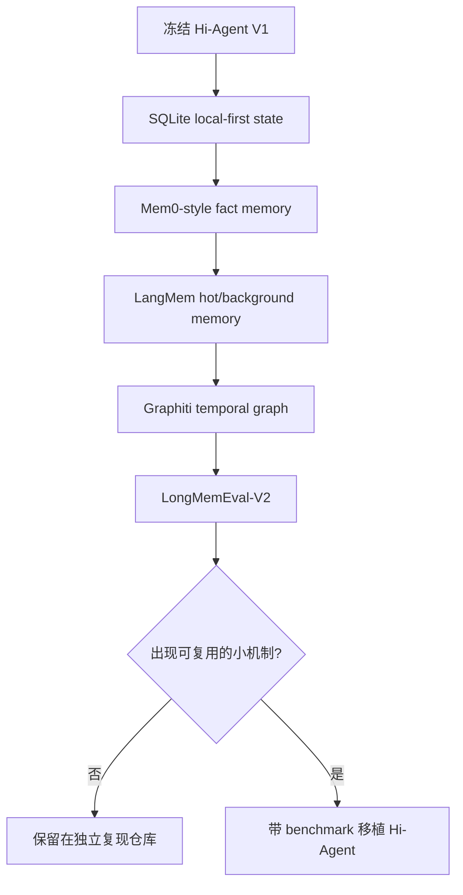

# Hi-Agent Context & Memory V2 — TO BE Done

> 状态：**Parked / 有缘再做**  
> 适用对象：未来的我、想从 Hi-Agent 继续练习 Context 与 Memory 的贡献者  
> 优先级说明：这不是承诺，也不是排期。V1 已经形成学习闭环；V2 只有在能回答新的研究问题时才值得启动。

## 0. 先写结论：V1 到此冻结

Hi-Agent 是我的学习脚手架，不是准备长期经营的 Agent 基础设施。

V1 已经完成了一条可以解释、可以测试、可以连接真实模型、也可以重复评测的最小链路：

```text
ContextItem
  → Budget / Selector / Compiler
  → ContextMessage
  → FormattedMessage
  → Provider payload
  → Fake Provider / Real Provider
  → ContextTrace / Eval Report
```

继续往 Hi-Agent 里堆 RAG、Memory、向量库、多 Agent、工具协议和 UI，很容易产生一种“项目越来越完整”的错觉，却不一定带来新的理解。与其把时间消耗在维护一个 toy framework 上，我更想直接阅读、复现和拆解已经在前沿问题上走得更远的项目，例如：

- Mem0：记忆抽取、更新、冲突处理与多路召回；
- Graphiti / Zep：带时间语义和来源追踪的知识图谱记忆；
- LangMem：热路径记忆工具、后台抽取与不同记忆类型；
- Letta / MemGPT：有状态 Agent、核心记忆与外部记忆的分层；
- SQLite local-first state：本地事件、全文检索、事务、迁移和可恢复状态；
- LongMemEval / LongMemEval-V2：用长程、多会话任务检验记忆系统，而不是只看 demo。

因此，V2 的原则是：

> **先在独立复现项目中理解一个机制，再决定是否把最小、可验证的部分移植回 Hi-Agent。**

如果没有明确的学习问题、对照实验和退出标准，就不启动 V2。

---

## 1. V2 的定位

### 1.1 它是什么

V2 是一个候选实验清单，用来回答 V1 没有回答的问题：

1. 上下文候选项从哪里来？
2. 跨会话信息如何被写入、更新、遗忘和召回？
3. 时间、来源、冲突和不确定性怎样进入记忆模型？
4. Context 选择如何从简单 priority 贪心升级为可评测的多信号决策？
5. 长运行 Agent 如何压缩历史，同时保留可恢复的状态？
6. 缓存、延迟、token 和正确率之间如何做工程权衡？

### 1.2 它不是什么

V2 不是下面这些东西：

- “把 Hi-Agent 做成另一个 LangChain”；
- 为了目录好看而增加抽象层；
- 为所有向量数据库写统一适配器；
- 在没有 benchmark 前实现一个复杂的 Memory Manager；
- 通过逆向私有产品，声称复现其内部算法；
- 把所有新论文都变成仓库里的半成品模块；
- 以测试数量代替真实行为质量。

### 1.3 时间分配建议

如果未来重新启动这条线，默认按下面的比例分配精力：

| 工作 | 建议占比 | 目的 |
| --- | ---: | --- |
| 阅读官方代码、论文与设计文档 | 25% | 搞清楚问题定义与真实边界 |
| 在独立小仓库复现 | 45% | 不受 Hi-Agent 既有接口束缚 |
| benchmark 与消融实验 | 20% | 判断机制是否真的有效 |
| 移植回 Hi-Agent | 10% | 只保留最小、可教学的实现 |

如果移植工作反过来占用了大部分时间，就说明方向偏了。

---

## 2. 启动 V2 的门槛

满足下面至少一项，才值得从 `parked` 改为 `active`：

- 我已经完成 Mem0、Graphiti/Zep、LangMem 或 Letta 中至少一个关键机制的独立复现；
- 我有一个 V1 无法回答的具体 benchmark 失败案例；
- 有贡献者希望用 Hi-Agent 学习 Context/Memory，并愿意围绕测试提交完整 PR；
- 某项设计能被压缩成一个小而清楚的教学模块，而不是引入一套新框架；
- 我准备写一篇需要真实对照实验支撑的新文章。

以下理由不足以启动 V2：

- “仓库好久没更新了”；
- “别的项目有这个类”；
- “可能以后有用”；
- “先把接口留出来”；
- “README 看起来不够像生产项目”。

---

## 3. P0：只在再次碰到仓库时顺手完成的 V1 收尾

P0 不是新功能。每一项都应限制在半天内，并且必须有测试。

### 3.1 对齐输入预算与 Provider 输出预算

当前系统存在两个相关但尚未绑定的值：

- `ContextBudget.output_reserve`：编译 Context 时为输出预留的 token；
- Provider 调用的 `max_tokens`：真实模型最多能生成的 token。

V1 曾出现 `output_reserve=20/64`，真实调用却使用 `max_tokens=32/256` 的情况。它不影响选择链路是否正确，却会让“总预算”语义不完整。

待办：

- [ ] 明确 `output_reserve` 是估算值还是 Provider 的硬配置；
- [ ] 如果二者必须相等，在调用边界增加校验；
- [ ] 如果允许不同，在 Contract 中解释原因；
- [ ] 增加 `output_reserve < requested_max_tokens` 或不一致场景测试；
- [ ] 报告中同时记录两者，不再让读者猜测。

验收标准：预算含义可以用一个公式解释，测试与 CLI 参数一致。

### 3.2 让 Eval CLI 能作为质量门禁

当前 runner 能生成报告，但“指标低于目标”与“进程失败”还不是同一个概念。

待办：

- [ ] 支持 `--min-exact-match`、`--min-must-select-recall` 等阈值；
- [ ] 任一阈值失败时返回非零退出码；
- [ ] Provider error 和数据格式错误使用不同退出码；
- [ ] 增加 runner exit-code 测试。

验收标准：CI 可以通过退出码判断是否发生质量回归。

### 3.3 增强报告可复现信息

待办：

- [ ] 记录 Git commit；
- [ ] 记录 fixture 的 SHA-256；
- [ ] 记录模型 ID、base URL 的非敏感标识和 Provider SDK 版本；
- [ ] 记录 token 计数模式；
- [ ] 记录运行时间、重复次数和随机参数；
- [ ] 禁止 API key 等秘密进入 artifact。

验收标准：别人仅凭报告能知道“什么代码、什么数据、什么模型、什么参数”产生了结果。

### 3.4 处理浅层不可变

`frozen dataclass` 只能阻止字段重新赋值，内部 `list` / `dict` 仍然可变。

待办：

- [ ] 判断 `ContextTrace` 是否真的需要作为不可变快照或缓存键；
- [ ] 需要时把 ID 列表改为 tuple；
- [ ] 明确 `metadata` 是否复制、冻结或只读；
- [ ] 先写深层不可变测试，再改模型。

验收标准：不要为了“更纯”而改；只有真实消费者依赖不可变语义才实现。

---

## 4. P1：优先做独立复现，而不是扩建 Hi-Agent

下面每个方向都应该放在独立仓库或独立实验目录中。每次只选一个。

## 4.1 Mem0 Mini：学习记忆写入与更新

### Mem0 方向想回答的问题

普通 RAG 假设知识已经存在；Memory 系统还必须决定：

- 一段对话中什么值得记？
- 新事实是新增、覆盖、合并，还是与旧事实冲突？
- 用户事实、会话事实和 Agent 状态是否应该分层？
- 召回时只靠向量相似度够不够？

### 最小复现范围

```text
conversation event
  → candidate fact extraction
  → normalize / deduplicate
  → add | update | delete | no-op
  → persistent store
  → hybrid retrieval
  → answer-time context
```

待办：

- [ ] 阅读 Mem0 当前版本的官方代码与论文，记录版本号；
- [ ] 定义 `MemoryFact`：内容、主体、来源、创建时间、更新时间、置信度；
- [ ] 实现最小写入决策：add / update / delete / no-op；
- [ ] 为冲突事实建立时间与来源测试；
- [ ] 比较 full history、vector-only、hybrid memory 三种基线；
- [ ] 在 LoCoMo 或 LongMemEval 子集上运行；
- [ ] 记录写入成本、召回成本、答案正确率和错误类型。

不要做：

- 一开始支持多个向量库；
- 复制 Mem0 的所有 API；
- 只演示“记住我的名字”就宣称完成 Memory。

退出标准：能解释至少一个“写错记忆比没写记忆更糟”的失败案例。

## 4.2 SQLite Local-First State：学习持久化，不冒充记忆算法

Cursor/VS Code 系产品使用 SQLite 状态文件保存 UI、聊天、Agent blob 或 checkpoint 等本地状态，这给了我一个很实际的学习方向。但必须保持边界：

> SQLite 是可靠的本地状态基础设施，不等于 Cursor 的 Memory 算法；Cursor 也没有公开一份可供准确复现的完整内部架构。

因此这里复现的是 local-first state store，而不是“Cursor Memory”。

### 建议 schema

```sql
CREATE TABLE events (
    event_id TEXT PRIMARY KEY,
    session_id TEXT NOT NULL,
    kind TEXT NOT NULL,
    payload_json TEXT NOT NULL,
    created_at TEXT NOT NULL
);

CREATE TABLE memories (
    memory_id TEXT PRIMARY KEY,
    subject TEXT NOT NULL,
    content TEXT NOT NULL,
    source_event_id TEXT NOT NULL,
    valid_from TEXT,
    valid_to TEXT,
    updated_at TEXT NOT NULL,
    FOREIGN KEY(source_event_id) REFERENCES events(event_id)
);
```

待办：

- [ ] append-only event log；
- [ ] SQLite WAL 与事务边界；
- [ ] FTS5 全文检索；
- [ ] schema migration；
- [ ] checkpoint 与 crash recovery；
- [ ] retention、删除和 `VACUUM` 策略；
- [ ] 导入、导出与隐私删除；
- [ ] 同一 session 的顺序与幂等写入测试；
- [ ] 将 keyword/FTS 结果与 embedding 结果合并排序。

不要做：

- 依赖 Cursor 私有表结构；
- 把 `state.vscdb` 当成稳定 API；
- 为了“像 Cursor”而忽略数据迁移和恢复测试。

退出标准：杀死进程后能恢复到一致状态，并能解释 event、snapshot、memory 三者的区别。

## 4.3 Graphiti / Zep Mini：学习时间感知图记忆

### Graphiti / Zep 方向想回答的问题

向量检索擅长“语义相似”，但对下面的问题不天然友好：

- 用户现在的公司和三个月前是否不同？
- 一个事实何时开始有效、何时失效？
- 这条关系来自哪段原始对话？
- 多跳关系是否比单个 chunk 更适合回答问题？

### 最小数据模型

```text
Episode  ——原始来源与时间
Entity   ——人、组织、项目、概念
FactEdge ——subject / predicate / object
           valid_at / invalid_at / created_at
           provenance_episode_id
```

待办：

- [ ] 从 episode 抽取 entity 和 relation；
- [ ] 实体规范化与去重；
- [ ] 为事实维护有效时间窗口；
- [ ] 新事实到来时使旧边失效，而不是覆盖来源；
- [ ] 混合 keyword、semantic 与 graph traversal；
- [ ] 回答时返回 provenance；
- [ ] 编写“事实更新”“时间先后”“多跳关系”测试；
- [ ] 与 flat vector memory 做消融对比。

不要做：

- 一开始部署复杂图数据库集群；
- 用 LLM 生成一张漂亮的图就当作正确；
- 忽略实体合并错误和时间冲突。

退出标准：在 temporal question 上优于 flat vector baseline，并能追溯到原 episode。

## 4.4 LangMem Mini：学习记忆类型与执行时机

LangMem 值得学习的重点不只是 API，而是两个维度：

1. 记什么：semantic、episodic、procedural；
2. 何时记：hot path 当场写入，或 background 异步抽取/合并。

待办：

- [ ] 复现 profile memory 与 collection memory 的差异；
- [ ] 实现 Agent 主动调用的 memory tool；
- [ ] 实现后台批处理：extract / consolidate / update；
- [ ] 比较热路径延迟和后台记忆新鲜度；
- [ ] 对 procedural memory 做最小 prompt optimization 实验；
- [ ] 测试重复写入、错误写入和延迟写入。

退出标准：可以用数据说明“什么时候同步写、什么时候后台写”，而不是只给架构图。

## 4.5 Letta / MemGPT Mini：学习分层状态与自我编辑

这是可选方向，优先级低于前四项。

待办：

- [ ] 区分 core memory、archival memory、conversation history；
- [ ] 复现 Agent 自己修改核心记忆的工具；
- [ ] 测试错误编辑、容量上限和恢复；
- [ ] 比较固定 profile 与可编辑 core memory；
- [ ] 记录“让模型管理自己的记忆”带来的安全边界。

退出标准：不仅展示记忆被写入，还要能处理误写和回滚。

---

## 5. P2：复现成功后，才允许回移 Hi-Agent

只有当独立实验的结果清楚、接口足够小，才考虑下面的模块。

### 5.1 ContextSource Adapter

目标：把 RAG、Memory、工具结果转换为统一 `ContextItem`，但不让 Context 层知道具体数据库。

候选接口：

```python
class ContextSource(Protocol):
    def collect(self, request: ContextRequest) -> list[ContextItem]: ...
```

验收标准：至少两个真实 source 使用同一接口；不存在只为一个实现服务的抽象。

### 5.2 Provider-aware Tokenizer

目标：用真实 tokenizer 或 Provider usage 校准 `token_count`。

待办：

- [ ] `TokenCounter` protocol；
- [ ] deterministic fake counter；
- [ ] 至少一个真实模型 tokenizer adapter；
- [ ] message envelope 开销；
- [ ] 估算值与 Provider usage 的误差报告；
- [ ] 不同模型的 token count 不共享缓存键。

### 5.3 多信号选择器

候选信号：

- task relevance；
- priority；
- recency / temporal validity；
- source reliability；
- redundancy；
- token cost；
- required policy。

不要直接把这些字段塞回 `ContextItem V1`。先让 scorer 或 policy 生成选择分数，并保留每个信号的解释。

验收标准：与 priority-only baseline 做消融实验；至少一个 benchmark 指标显著改善。

### 5.4 Compaction 与恢复

目标不是“让 LLM 随便总结”，而是设计可恢复的长期任务状态。

候选输出：

- 当前目标；
- 已完成与未完成步骤；
- 决策及理由；
- artifact/checkpoint 引用；
- 不确定项与待验证项；
- 原始事件范围。

待办：

- [ ] compaction contract；
- [ ] checkpoint schema；
- [ ] 原文引用与 provenance；
- [ ] 多轮 compaction 漂移测试；
- [ ] compaction 前后任务恢复率对比。

### 5.5 Cache-stable Context Serialization

目标：测量稳定前缀与 append-only history 对 prompt cache 的真实影响。

待办：

- [ ] 固定 system/tool 前缀；
- [ ] 避免在前缀注入动态时间戳；
- [ ] 确定性 JSON / message serialization；
- [ ] append-only 与重写历史的 A/B；
- [ ] 记录 cached tokens、TTFT、总延迟与费用；
- [ ] 不把一次 provider cache hit 当成完整实验。

### 5.6 Tool Call 与 Provider Adapter

只有真实任务需要时才做：

- [ ] 明确 `tool_result` 对 OpenAI-compatible API 的结构；
- [ ] 保留 `tool_call_id`；
- [ ] 不把 tool result 粗暴映射成普通 user message；
- [ ] 不同 Provider 的 capability matrix；
- [ ] unsupported kind 显式失败。

### 5.7 Observability

待办：

- [ ] 每次编译的 trace ID；
- [ ] selected / dropped 原因；
- [ ] token 估算与真实 usage；
- [ ] source latency；
- [ ] memory write/read 事件；
- [ ] 内容脱敏与采样策略。

验收标准：能复盘一次错误选择，但日志不会泄露完整私人记忆。

---

## 6. P3：评测优先于“功能完整”

### 6.1 Benchmark 选择

| 数据集/任务 | 主要能力 | 适合验证 |
| --- | --- | --- |
| Hi-Agent Contract Cases | 选择器确定性与预算规则 | 单元/属性测试 |
| Hi-Agent Real LLM Cases | 小规模真实 Provider 闭环 | smoke / regression |
| LoCoMo | 长对话记忆与问答 | Mem0-style memory |
| LongMemEval | 多会话长期记忆 | 检索、更新、时间、拒答 |
| LongMemEval-V2 | 超长 Agent 轨迹与状态 | workflow/state memory |
| 自建 temporal cases | 事实生效与失效 | Graphiti/Zep-style graph |

### 6.2 最低指标集合

选择层：

- must-select recall；
- distractor exclusion；
- required coverage；
- selected token cost；
- selection stability。

答案层：

- exact match / task-specific correctness；
- required evidence use；
- forbidden leakage；
- temporal correctness；
- abstention accuracy。

系统层：

- write latency；
- retrieval latency；
- end-to-end latency；
- prompt/completion/reasoning/cached tokens；
- provider error；
- memory growth；
- cost per successful task。

### 6.3 必做消融

任何“新机制有效”的结论，至少比较：

1. 无 Memory，仅当前输入；
2. 全量历史；
3. 简单 recent-k；
4. vector-only；
5. 新方法；
6. 新方法去掉一个关键组件。

否则很难知道提升来自设计，还是来自更多 token。

---

## 7. 推荐的学习顺序



这个顺序不是按“项目名气”排列，而是按依赖关系排列：

1. 先理解可靠状态；
2. 再理解记忆写入与读取；
3. 再拆分同步和后台流程；
4. 最后进入图、时间和超长轨迹；
5. 用 benchmark 判断是否值得抽象。

---

## 8. 给未来贡献者的任务切片

如果有人想通过 Hi-Agent 学习，可以优先挑下面这种一到两个 PR 能闭环的任务。

### Good First Issue

- [ ] 为 Eval report 增加 fixture hash；
- [ ] 为阈值失败增加非零退出码；
- [ ] 把 `ContextTrace` ID 列表改成 tuple，并补测试；
- [ ] 增加 token counter protocol 与 fake 实现；
- [ ] 给文档补一张真实失败报告的解释；
- [ ] 增加一个不依赖网络的 property-based selector 测试。

### Intermediate

- [ ] SQLite event store：事务、幂等与恢复；
- [ ] FTS5 source adapter；
- [ ] real tokenizer 与估算误差报告；
- [ ] compaction checkpoint contract；
- [ ] provider cache A/B runner。

### Research / Experimental

- [ ] memory update conflict benchmark；
- [ ] temporal graph 与 vector baseline 消融；
- [ ] LongMemEval-V2 子集适配；
- [ ] context selection 多信号学习排序；
- [ ] 长任务 compaction 漂移评测。

每个 PR 都应包含：

- 问题陈述；
- 明确非目标；
- Contract；
- Red/Green 测试；
- benchmark 或最小对照；
- 文档；
- 不引入无关重构。

---

## 9. 明确不做的清单

下面这些默认不进入 Hi-Agent：

- 通用 Agent SaaS；
- Web 管理后台；
- 多租户与计费；
- 分布式向量数据库；
- 多 Agent orchestration framework；
- 自研 embedding 模型；
- 私有 Cursor 数据库兼容层；
- 十几个 Provider 的无测试 adapter；
- 为了“支持未来”而存在的空类；
- 没有 provenance 的自动摘要；
- 没有 benchmark 的 Memory 宣传数字。

这份“不做清单”不是保守，而是为了保护学习时间。

---

## 10. V2 的 Definition of Done

V2 不以“所有 checkbox 打勾”为完成标准。满足下面条件中的一个完整闭环即可：

### 路线 A：Memory 写入闭环

- 有可执行的写入/更新/删除 Contract；
- 在公开数据集上对比至少三个 baseline；
- 能解释冲突、误写和遗忘失败；
- 结果可复现。

### 路线 B：Local-first 状态闭环

- SQLite event store 可迁移、可恢复、可检索；
- crash test 与幂等测试通过；
- 能从 checkpoint 恢复一个长任务；
- 数据可以导出与删除。

### 路线 C：Temporal Graph 闭环

- 事实带来源与有效时间；
- 支持更新和失效；
- temporal benchmark 优于 flat vector baseline；
- 错误实体合并可以追踪。

### 路线 D：Context Efficiency 闭环

- 真实 tokenizer；
- cache-stable serialization；
- compaction/recovery；
- 正确率、延迟、token、cache 命中均有 A/B 报告。

完成任一路线后再决定有没有 V3。不要预先设计 V3。

---

## 11. 参考项目与阅读入口

- [Anthropic: Effective context engineering for AI agents](https://www.anthropic.com/engineering/effective-context-engineering-for-ai-agents)
- [Manus: Context Engineering for AI Agents](https://manus.im/blog/Context-Engineering-for-AI-Agents-Lessons-from-Building-Manus)
- [Mem0 GitHub](https://github.com/mem0ai/mem0)
- [Mem0 paper](https://arxiv.org/abs/2504.19413)
- [Graphiti GitHub](https://github.com/getzep/graphiti)
- [Zep paper](https://arxiv.org/html/2501.13956v1)
- [LangMem documentation](https://langchain-ai.github.io/langmem/)
- [Letta GitHub](https://github.com/letta-ai/letta)
- [LongMemEval](https://github.com/xiaowu0162/LongMemEval)
- [LongMemEval-V2](https://github.com/xiaowu0162/LongMemEval-V2)
- [Cursor forum: state.vscdb growth discussion](https://forum.cursor.com/t/cursor-state-vscdb-growing-at-1-gb-in-a-day/151747)

阅读时优先确认版本、测试和论文中的真实实验，不把 README 的一句描述直接当作架构事实。

---

## 12. 写给未来的我

Hi-Agent 最有价值的部分，不是它会不会成长为一个“完整框架”，而是它已经让我亲手走过：契约、模型、预算、选择、编译、消息边界、Provider、Trace 和 Eval。

V1 证明了一个小项目也能形成严格的学习闭环。V2 如果有一天启动，也应该继续服务于这个目标：

> 不是为了把 TODO 清空，而是为了把一个还不懂的问题，变成能解释、能复现、能证伪的知识。

如果当时已有更好的开源实现，就先去读它、跑它、拆它。只有当移植回 Hi-Agent 能帮助别人更容易理解这个机制时，再写那段代码。
