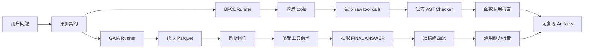
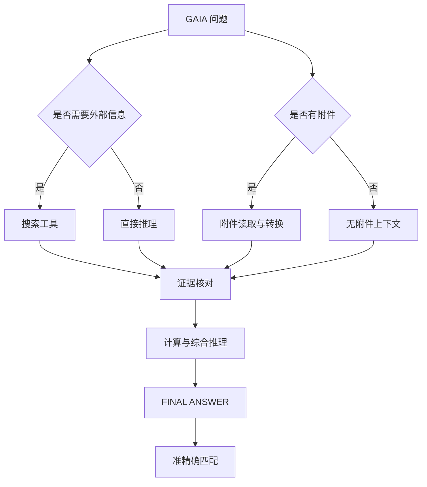
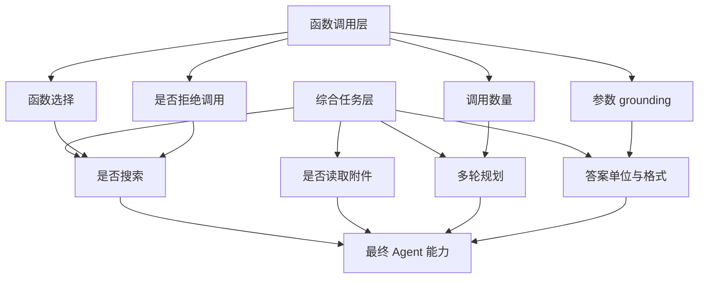

# 从工具调用到通用助手：Hi-Agent 性能评估学习笔记

## 0. 为什么 Agent 需要专门的评测？

我们已经可以让一个 Agent 调用计算器、搜索引擎、文件读取器，甚至让它完成多轮任务。此时最容易产生一种错觉：

> 只要 Agent 能够运行，就说明它已经具备了可靠的智能。

但“能运行”和“能力可靠”之间还有很大距离。Agent 可能函数名选对了却填错参数，也可能工具调用成功了却在最后一步把答案单位写错。评测的作用，就是把这些隐蔽的失败拆成可以观察、比较和复现的行为契约。

本篇以两个基准为主线：

```text
BFCL：Agent 会不会正确调用工具？
GAIA：Agent 能不能借助工具解决真实世界问题？
```

## 1. 先建立评测的基本框架

### 1.1 Benchmark、Dataset、Evaluator、Metrics

| 概念 | 要回答的问题 | 在本项目中的对应物 |
| --- | --- | --- |
| Benchmark | 我们要测哪一种能力？ | BFCL、GAIA |
| Dataset | 具体输入和标准答案是什么？ | BFCL JSON、GAIA Parquet |
| Agent | 被测系统如何产生答案？ | `MyFunctionCallAgent`、Provider 请求 |
| Evaluator | 如何把运行变成可判断结果？ | AST checker、准精确匹配 |
| Metrics | 用什么数字总结结果？ | Accuracy、错误分类、延迟、Token Usage |
| Artifact | 如何保存证据？ | JSON、JSONL、Markdown 报告 |

当结果变差时，我们应该能够回答：

```text
是数据加载错了？是工具 schema 错了？是模型真的不会？
是评分器把正确答案判错了？还是日志没有保存足够证据？
```

### 1.2 准确率不是唯一指标

```python
accuracy = correct_samples / total_samples
```

准确率只能回答“多少题通过”，不能解释失败类型。因此 Runner 还记录：

```text
wrong function name / wrong number of calls
missing required parameter / unexpected parameter
invalid JSON arguments / provider error
finish_reason=length / latency / token usage
```

准确率是摘要，逐样本报告才是证据。

## 2. BFCL 和 GAIA：两种不同的 Agent 能力

| 维度 | BFCL | GAIA |
| --- | --- | --- |
| 核心问题 | 能否产生正确的函数调用？ | 能否解决真实世界的综合问题？ |
| 输入 | 用户问题 + 函数描述 | 问题 + 可选附件 + 外部信息需求 |
| 工具执行 | 主要检查 raw tool call | 搜索、计算、文件处理、多轮推理 |
| 输出 | 函数名和 JSON 参数 | 最终答案文本 |
| 评分 | AST / 结构化调用匹配 | 准精确答案匹配 |

BFCL 关注 Agent 的“手”：它是否能准确操作工具。GAIA 关注 Agent 的“脑和手”：它是否能判断要做什么、调用哪些工具、读取哪些材料，并最终给出标准答案。



最重要的边界是：

```text
BFCL 观察“第一次函数调用长什么样”
GAIA 观察“Agent 最终能不能完成任务”
```

## 3. 环境也是评测契约的一部分

### 3.1 BFCL 的独立环境

最初在 Conda `base` 中安装 BFCL 时，`pip` 使用 Python 3.13，并尝试从源码编译 `numpy==1.26.4`。Windows 没有可用 C/C++ 编译器，于是安装失败。

后来使用：

```text
D:\MyLab\hi-agent\evals\llm_evals\temp_gorilla\berkeley-function-call-leaderboard\.venv
```

验证结果：

```text
Python: 3.10.20
NumPy: 1.26.4
bfcl_eval: ...\berkeley-function-call-leaderboard\bfcl_eval\__init__.py
```

BFCL checker 还间接依赖 `qwen_agent`，所以在这个独立环境补充了 `soundfile`。它没有安装到 Conda base。

### 3.2 GAIA 的项目环境

GAIA Runner 使用：

```text
D:\MyLab\hi-agent\.venv
```

项目依赖中增加了：

```toml
"markitdown[docx,pdf,pptx,xlsx]>=0.1.0"
"pyarrow>=18.0.0"
"tavily-python>=0.8.0"
```

```text
BFCL .venv：官方 checker 和 BFCL 依赖
hi-agent .venv：GAIA Runner、Agent、MarkItDown、Tavily
```

评测笔记必须记录实际解释器，而不能只写“安装成功”。

## 4. BFCL：先测会不会调用工具

### 4.1 数据契约

BFCL 当前使用：

```text
BFCL_v4_<category>.json
```

一条样本包含：

```text
question          按 turn 包裹的消息
function          当前样本可用的函数描述
possible_answer   标准函数调用答案
```

单轮请求实际使用 `question[0]`，工具表必须来自当前样本：

```python
messages = prompt["question"][0]
tools = build_provider_tools(prompt["function"])
```

`irrelevance` 是例外：它的目标是不要产生函数调用，所以正确预测是：

```json
[]
```

### 4.2 四类任务分别测什么？

```text
simple_python  → 一次函数调用是否正确
multiple       → 多个候选函数中是否选择正确的那个
parallel       → 同一轮是否返回多个独立调用
irrelevance    → 无关问题是否知道不要调用工具
```

`multiple` 不等于“必须调用多个函数”，它主要测候选函数选择：

```text
候选函数很多 → 理解用户意图 → 只选择正确函数
```

`parallel` 则要求一个回答返回多个调用：

```json
[
  {"spotify_play": {"artist": "Taylor Swift", "duration": 20}},
  {"spotify_play": {"artist": "Maroon 5", "duration": 15}}
]
```

Runner 显式打开：

```python
request_kwargs["parallel_tool_calls"] = True
```

并保存全部 `tool_calls`。官方 checker 对 parallel 结果进行无序匹配。

### 4.3 Provider Schema 适配

BFCL 可能使用：

```json
{"type": "dict"}
```

Provider 通常需要：

```json
{"type": "object"}
```

因此集中转换：

```python
TYPE_MAP = {"dict": "object", "float": "number", "tuple": "array"}


def normalize_schema_types(value):
    if isinstance(value, dict):
        return {
            key: (
                TYPE_MAP.get(item, item)
                if key == "type" and isinstance(item, str)
                else normalize_schema_types(item)
            )
            for key, item in value.items()
        }
    if isinstance(value, list):
        return [normalize_schema_types(item) for item in value]
    return value
```

函数名也需要适配：

```text
math.factorial → math_factorial
spotify.play   → spotify_play
```

第一次扩展运行时，`float` 被原样发送给 Provider，部分请求在模型调用前就被拒绝。转换为 `number` 后，`multiple` 样本全部通过。

### 4.4 为什么不直接调用生产 Agent？

生产路径是：

```text
模型响应 → 读取 tool_calls → 执行工具 → 发回 tool result → 最终回答
```

BFCL 只想观察第一次响应的原始函数调用。如果直接调用：

```python
agent.run(question)
```

工具执行和最终回答会隐藏函数选择证据。因此 Runner 直接复用 Provider client：

```python
response = client.chat.completions.create(
    model=model,
    messages=messages,
    tools=tools,
    tool_choice="auto",
    temperature=temperature,
    max_tokens=max_tokens,
)
tool_calls = response.choices[0].message.tool_calls
prediction = extract_tool_result(tool_calls)
```

评测边界必须和要观察的能力边界一致。

### 4.5 BFCL 的评分不是字符串比较

官方 AST checker 关注：

```text
函数名 / 参数名 / 参数值
调用数量 / parallel 无序匹配
```

字段顺序不同不一定是错误：

```json
{"base": 10, "height": 5}
{"height": 5, "base": 10}
```

但下面是实质错误：

```text
normal hemoglobin
normal human hemoglobin
```

### 4.6 运行命令与结果

```powershell
$bfclRoot = "D:\MyLab\hi-agent\evals\llm_evals\temp_gorilla\berkeley-function-call-leaderboard"
$env:BFCL_PROJECT_ROOT = $bfclRoot
$env:PYTHONPATH = "D:\MyLab\hi-agent"
$python = "$bfclRoot\.venv\Scripts\python.exe"
$runner = "D:\MyLab\hi-agent\evals\llm_evals\bfcl_simple_python.py"

& $python $runner --category simple_python --samples 5 --temperature 0 --max-tokens 512
& $python $runner --category multiple --samples 5 --temperature 0 --max-tokens 512
& $python $runner --category parallel --samples 5 --temperature 0 --max-tokens 512
& $python $runner --category irrelevance --samples 5 --temperature 0 --max-tokens 512
```

模型为 `deepseek-v4-flash`，`temperature=0`，每类 5 条：

| 类别 | 结果 | 观察 |
| --- | ---: | --- |
| `simple_python` | 5/5 = 100% | 基础单函数调用闭环正常 |
| `multiple` | 5/5 = 100% | 候选函数选择在小样本上正确 |
| `parallel` | 4/5 = 80% | 多调用结构正确，但有一个字符串参数错误 |
| `irrelevance` | 5/5 = 100% | 模型能在这组题上拒绝无关工具 |

`parallel` 唯一失败中，模型返回了 `normal human hemoglobin` 和 `rat hemoglobin`，而标准答案要求 `normal hemoglobin`。第一次运行还使用了 `max_tokens=256`，出现了 `finish_reason=length`；提升到 `512` 后调用数量问题消失，只剩参数值错误。

报告产物：

```text
D:\MyLab\hi-agent\artifacts\bfcl-simple-python.json
D:\MyLab\hi-agent\artifacts\bfcl-multiple.json
D:\MyLab\hi-agent\artifacts\bfcl-parallel.json
D:\MyLab\hi-agent\artifacts\bfcl-irrelevance.json
```

## 5. GAIA：再测能不能解决真实问题

### 5.1 GAIA 任务为什么更难？

GAIA 可能要求 Agent：

```text
理解自然语言问题
   ↓
判断是否需要搜索
   ↓
读取 PDF / Excel / 图片 / 音频附件
   ↓
进行计算或多步推理
   ↓
把答案压缩成指定格式
```



### 5.2 当前 GAIA 数据是 Parquet

数据位于：

```text
evals/llm_evals/gaia/
```

当前读取：

```text
2023/validation/metadata.parquet
2023/test/metadata.parquet
```

官方 README 说明当前数据使用 Parquet，字段包括 `task_id`、`Question`、`Level`、`Final answer`、`file_name`、`file_path`，参见 [GAIA 官方 README](https://huggingface.co/datasets/gaia-benchmark/GAIA/blob/main/README.md)。

Runner 把数据标准化成：

```python
@dataclass(frozen=True)
class GAIAItem:
    task_id: str
    question: str
    level: int
    final_answer: str | None
    file_name: str | None
    file_path: str | None
    attachment_path: Path | None
```

核心读取逻辑：

```python
import pyarrow.parquet as parquet


def load(self):
    rows = parquet.read_table(self.metadata_path).to_pylist()
    items = [self._standardize(row) for row in rows]
    if self.level is not None:
        items = [item for item in items if item.level == self.level]
    return items
```

本地验证：

```text
validation：165 条，Level 1/2/3 = 53/86/26，带附件 38 条
test：301 条，Level 1/2/3 = 93/159/49，带附件 71 条
```

即使本地 test 快照包含答案列，Runner 仍然强制：

```python
final_answer = None if self.split == "test" else raw_answer
```

### 5.3 附件不是一个字符串路径

只把文件名放进 Prompt，模型并不能自动读取文件：

```text
附件：abc.xlsx
```

因此需要真正的附件工具：

```python
class GAIAAttachmentTool(MyTool):
    name = "read_attachment"

    def get_parameters(self):
        return [
            ToolParameter(
                name="file_name",
                type="string",
                description="题目提供的附件文件名或相对路径",
                required=True,
            )
        ]

    def run(self, parameters):
        path = dataset.resolve_attachment(parameters["file_name"])
        document = MarkitdownLoader().load(
            path,
            user_id="gaia-eval",
            namespace="validation",
        )
        return document.text
```

路径必须做边界检查：

```python
resolved = (self.split_root / candidate).resolve()
if self.split_root not in resolved.parents:
    raise ValueError("GAIA attachment escapes split root")
```

这次真实验证了一个 `.xlsx` 附件。最初只有 `markitdown[pdf]`，因此出现：

```text
XlsxConverter threw MissingDependencyException
```

补充 `docx/pdf/pptx/xlsx` extras 后，成功得到：

```text
## Sheet1
Flop Video Rental Store
1001 Rewind Drive, Seattle WA
```

所以“支持附件”至少包含：

```text
文件存在 → 解析器能打开 → 转换结果足够清晰 → 模型能使用
```

### 5.4 搜索工具：key 不等于 SDK

第一次 GAIA 运行时，`.env` 中的 key 可以被解析，但仍出现：

```text
Tavily 库未安装
SerpApi 库未安装
```

原因是环境变量只提供认证信息，Python 包仍需安装：

```powershell
uv add tavily-python
```

修复后：

```text
Tavily 搜索源已启用
available_backends = ['tavily']
```

排查第三方工具要分别检查：

```text
环境变量是否存在
Python SDK 是否能 import
SDK 是否能初始化
API 请求是否成功
返回结果是否真的被 Agent 使用
```

### 5.5 答案抽取与准精确匹配

GAIA 要求最终输出：

```text
FINAL ANSWER: <answer>
```

Runner 的抽取逻辑：

```python
def extract_answer(response: str) -> str:
    marker = re.search(
        r"FINAL ANSWER\s*:\s*(.+?)(?:\r?\n|$)",
        response,
        re.IGNORECASE,
    )
    if marker:
        return marker.group(1).strip().strip("[]").strip()

    lines = [line.strip() for line in response.splitlines() if line.strip()]
    return lines[-1] if lines else response.strip()
```

规范化减少大小写、空格、数字逗号等表面差异：

```python
def normalize_answer(answer: str | None) -> str:
    if not answer:
        return ""
    answer = answer.strip().strip("[]").lower()
    answer = answer.replace("$", "").replace("%", "")
    answer = re.sub(r"(?<=\d),(?=\d)", "", answer)
    answer = " ".join(answer.split())
    return answer.rstrip(".,;:!?")
```

准精确匹配不是语义理解。下面两者可能在人类看来接近，但仍可能被判错：

```text
17
17000
```

这正是本次第一题的真实失败。

## 6. GAIA 的真实 Level 1 运行

```powershell
$env:GAIA_PROJECT_ROOT = "D:\MyLab\hi-agent\evals\llm_evals\gaia"

uv run python `
  "D:\MyLab\hi-agent\evals\llm_evals\gaia_runner.py" `
  --split validation `
  --level 1 `
  --samples 5 `
  --temperature 0 `
  --max-tokens 4096
```

配置：

```text
model：deepseek-v4-flash
temperature：0
max_tokens：4096
split：validation
level：1
samples：5
```

实际结果：

```text
Accuracy: 2/5 = 40.00%
```

逐题结果：

| 题目类型 | 结果 | 失败原因 |
| --- | ---: | --- |
| 马拉松速度与月球距离 | FAIL | 约 17.125 千小时被回答成 `17000` |
| Mercedes Sosa 专辑数量 | FAIL | DSML tool-call 标记泄漏成最终文本 |
| 乒乓球概率谜题 | FAIL | Agent 返回 `（无内容）` |
| University of Leicester 鱼袋体积 | PASS | 搜索得到 `0.1777` |
| 视频中的鸟类数量 | PASS | 搜索得到 `3` |

结果文件：

```text
D:\MyLab\hi-agent\artifacts\gaia-validation-level1-20260826T100725Z.jsonl
D:\MyLab\hi-agent\artifacts\gaia-validation-level1-20260826T100725Z.json
```

不能简单说“GAIA = 40%”。更准确的结论是：在当前模型、提示词、搜索后端、工具集合、最大轮数和评分规则下，5 条 Level 1 validation 中有 2 条完整通过。

这组结果证明搜索链路已经接通，但暴露出：

```text
答案单位 grounding
Provider 协议兼容
复杂任务的最终回答稳定性
```

## 7. 两个基准的失败如何连接？



BFCL 的 `parallel` 参数错误，和 GAIA 的“17 与 17000”虽然表面不同，却有共同根因：

> 模型大致理解了任务，却没有把答案精确 grounding 到标准格式。

## 8. 证据链与学习结论

### 8.1 BFCL 证据

```text
simple_python：5/5 = 100%
multiple：5/5 = 100%
parallel：4/5 = 80%
irrelevance：5/5 = 100%
```

报告：

```text
artifacts/bfcl-simple-python.json
artifacts/bfcl-multiple.json
artifacts/bfcl-parallel.json
artifacts/bfcl-irrelevance.json
```

### 8.2 GAIA 证据

```text
Level 1 validation：2/5 = 40%
```

报告：

```text
artifacts/gaia-validation-level1-20260826T100725Z.jsonl
artifacts/gaia-validation-level1-20260826T100725Z.json
```

### 8.3 这次真正学到的知识点

#### 知识点一：评测必须先定义能力边界

```text
BFCL：截取第一次 tool call
GAIA：执行多轮工具循环，评估最终答案
```

#### 知识点二：数据格式就是系统接口

BFCL 的 `question[0]`、GAIA 的 `Question`、`Final answer`、`file_path` 都是 Dataset 与 Evaluator 之间的接口契约。

#### 知识点三：工具能力由多个条件共同决定

```text
工具可用 ≠ API key 存在
```

真正的工具可用性是：

```text
环境变量 × Python SDK × 初始化 × API 请求 × 返回结果消费
```

#### 知识点四：准确率必须结合失败样本阅读

BFCL 的 `parallel=80%`、GAIA 的 `2/5`，如果只看数字都很抽象。逐题阅读后，才知道它们分别是字符串参数错误、单位错误、协议泄漏和空回答。

#### 知识点五：小样本结果只能证明闭环，不代表泛化

5 条题全部通过，只能说明这组契约没有观察到失败；5 条中通过 2 条，也只能说明当前配置下存在可复现的失败模式。它们都不能直接代表 leaderboard 成绩或生产可靠性。

## 9. 下一步优化路线

### 9.1 先修复答案层

当前最有价值的三个修复是：

1. 明确答案单位，例如要求的是“千小时数值”，不是“小时数”；
2. 对 Provider 的 DSML 特殊标记做协议层解析，不让它进入最终答案；
3. 模型返回空内容时记录 finish reason，并触发一次受控重试。

```python
def validate_final_answer(response: str) -> tuple[bool, str]:
    answer = extract_answer(response)
    if not answer:
        return False, "empty_answer"
    if "DSML" in answer or "tool_calls" in answer:
        return False, "protocol_leak"
    return True, answer
```

### 9.2 再增强工具层

GAIA 后续需要逐步补齐：

```text
搜索引用与证据缓存
PDF / Office / 图片解析
音频转录
Python 沙箱
浏览器或受控网页读取
```

每增加一个工具，都要同时增加工具 schema、权限边界、错误处理、离线测试和调用日志。

### 9.3 最后扩大评测规模

推荐顺序：

```text
Level 1：5 条 smoke test
Level 1：53 条完整 validation
Level 2：5 条 smoke test
Level 3：5 条 smoke test
多次重复运行与模型对比
```

不要一开始就运行全量，然后只得到一个无法解释的总分。

## 10. 罗盘式总结

这次真正完成的不是“多写了两个 Runner”，而是建立了一套可以继续扩展的评测思维：

```text
先定义 Contract
再划分 Boundary
然后保存 Artifact
最后区分 Proves / Does not prove
```

BFCL 让我看到 Agent 是否会精确调用工具；GAIA 让我看到，工具调用只是综合任务中的一个环节。真正可靠的 Agent 还必须能处理外部信息、附件、多个工具轮次、答案单位和最终输出协议。

所以本次结果最重要的结论不是：

```text
BFCL 很高，GAIA 只有 40%
```

而是：

```text
工具选择已经基本成形；
并行调用和无关工具拒绝已经可以测量；
搜索链路已经接通；
但答案 grounding、协议兼容和复杂任务收尾仍然是主要短板。
```

这就是评测的价值：它不只是给 Agent 排名，而是告诉我们下一轮应该修哪一层。
